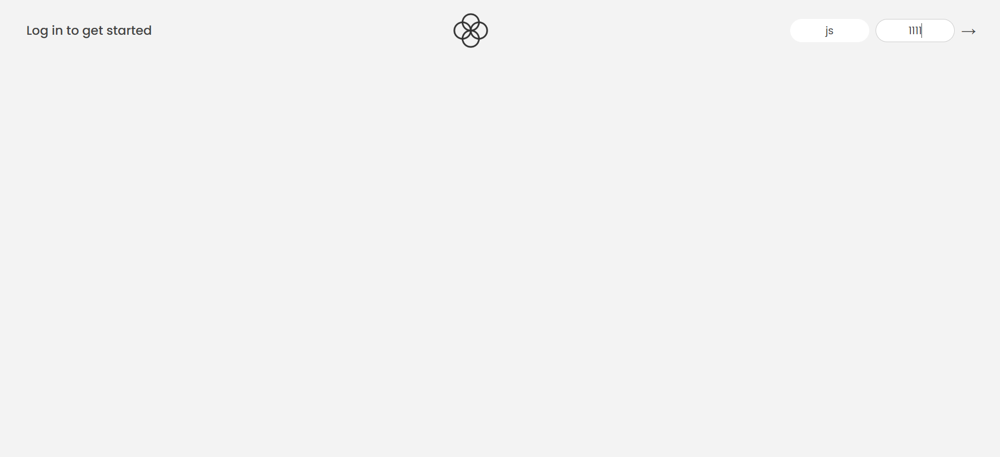

# Forkify

Is an advanced JavaScript banking application in which users can check their balance, transfer money, request loan

- This web application is not mobile responsive, so open the demo in desktop view

---

## Live Demo

### login info:

#### user: js

#### pin: 1111

https://auzair-17.github.io/bankist/

---

## Screenshots




---

## Features

- Simple user login
- Check your balance, and account history
- Transfer money
- Request loan
- Close account

## Technologies Used

- HTML
- CSS
- JavaScript

---

## Installation

### Step 1: Clone the repository

```bash
git clone https://github.com/auzair-17/bankist.git
```

### Step 2: Go to project directory

```bash
cd forkify-js-recipe-app
```

### Step 3: Start development server

```bash
npm run dev
```

## Author

**Auzair**

- Github: https://github.com/auzair-17
